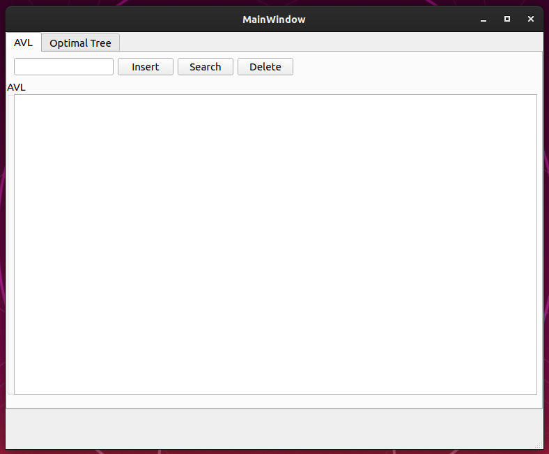
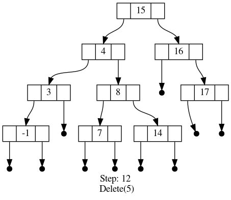

# DataStructures
Implementation of some basic data structures  during data structures course

Here you are able to find my implementation of some data structures like AVL, Splay tree and hashing (open and closed).

For visualisation purpose, I designed a GUI interface using PyQT5 and Graphviz for visualising insert, search and deletion operations in AVL tree.

The current state of AVL tree is saved in ``modules/AVL/graphviz_avl`` folder after each operation. One final example is shown bellow

